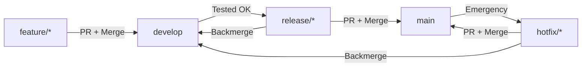

# Vercel Configuration for Gitflow

## Step-by-Step Setup Guide

### 1. Configure Production Branch

**Go to:** https://vercel.com → Select `fe-engine-prime` project → Settings →
Git

1. **Production Branch:**

   - Set to: `main`
   - This makes `main` deploy to your production domain

2. **Automatic deployments:**
   - Enable for: `main`, `develop`
   - Vercel will auto-deploy these branches

---

### 2. Set Up Environment Variables

**Go to:** Vercel Dashboard → Settings → Environment Variables

#### Add Production Variables (main branch ONLY)

Click "Add New" for each:

| Name                    | Value                                    | Environment |
| ----------------------- | ---------------------------------------- | ----------- |
| `NODE_ENV`              | `production`                             | Production  |
| `NEXTAUTH_URL`          | `https://fe-engine-prime.vercel.app`     | Production  |
| `NEXTAUTH_SECRET`       | Generate with: `openssl rand -base64 32` | Production  |
| `AUTH_SECRET`           | Same as NEXTAUTH_SECRET                  | Production  |
| `DATABASE_URL`          | Your production database URL             | Production  |
| `GOOGLE_CLIENT_ID`      | Production Google OAuth ID               | Production  |
| `GOOGLE_CLIENT_SECRET`  | Production Google OAuth secret           | Production  |
| `GITHUB_CLIENT_ID`      | Production GitHub OAuth ID               | Production  |
| `GITHUB_CLIENT_SECRET`  | Production GitHub OAuth secret           | Production  |
| `DISCORD_CLIENT_ID`     | Production Discord OAuth ID              | Production  |
| `DISCORD_CLIENT_SECRET` | Production Discord OAuth secret          | Production  |

#### Add Preview Variables (develop, release/_, hotfix/_, feature/\*, PRs)

Click "Add New" for each:

| Name                    | Value                                                           | Environment |
| ----------------------- | --------------------------------------------------------------- | ----------- |
| `NODE_ENV`              | `development`                                                   | Preview     |
| `NEXTAUTH_URL`          | Use `https://$VERCEL_URL` (dynamic)                             | Preview     |
| `NEXTAUTH_SECRET`       | Generate with: `openssl rand -base64 32` (different from prod!) | Preview     |
| `AUTH_SECRET`           | Same as NEXTAUTH_SECRET                                         | Preview     |
| `DATABASE_URL`          | Your dev/staging database URL                                   | Preview     |
| `GOOGLE_CLIENT_ID`      | Development Google OAuth ID                                     | Preview     |
| `GOOGLE_CLIENT_SECRET`  | Development Google OAuth secret                                 | Preview     |
| `GITHUB_CLIENT_ID`      | Development GitHub OAuth ID                                     | Preview     |
| `GITHUB_CLIENT_SECRET`  | Development GitHub OAuth secret                                 | Preview     |
| `DISCORD_CLIENT_ID`     | Development Discord OAuth ID                                    | Preview     |
| `DISCORD_CLIENT_SECRET` | Development Discord OAuth secret                                | Preview     |

**Important:** Use `https://$VERCEL_URL` for NEXTAUTH_URL in Preview
environment - Vercel will automatically replace it with the actual preview URL.

---

### 3. Configure OAuth Providers

You need **separate OAuth apps** for dev and prod:

#### Google OAuth

**Production (https://console.cloud.google.com):**

1. Create project: "FE Engine Prime - Production"
2. Enable Google+ API
3. Credentials → Create OAuth 2.0 Client ID
4. Authorized redirect URIs:
   - `https://fe-engine-prime.vercel.app/api/auth/callback/google`
5. Copy Client ID and Secret → Vercel Production env vars

**Development:**

1. Create project: "FE Engine Prime - Development"
2. Authorized redirect URIs:
   - `https://fe-engine-prime-git-develop.vercel.app/api/auth/callback/google`
   - `http://localhost:3000/api/auth/callback/google`
3. Copy Client ID and Secret → Vercel Preview env vars

#### GitHub OAuth

**Production (https://github.com/settings/developers):**

1. New OAuth App: "FE Engine Prime - Production"
2. Homepage URL: `https://fe-engine-prime.vercel.app`
3. Authorization callback URL:
   - `https://fe-engine-prime.vercel.app/api/auth/callback/github`
4. Copy Client ID and Secret → Vercel Production env vars

**Development:**

1. New OAuth App: "FE Engine Prime - Development"
2. Homepage URL: `https://fe-engine-prime-git-develop.vercel.app`
3. Authorization callback URL:
   - `https://fe-engine-prime-git-develop.vercel.app/api/auth/callback/github`
   - `http://localhost:3000/api/auth/callback/github`
4. Copy Client ID and Secret → Vercel Preview env vars

#### Discord OAuth

Similar setup - create separate apps for production and development.

---

### 4. Verify Deployments

**After setting up env vars:**

1. **Trigger development deployment:**

   ```bash
   git checkout develop
   git commit --allow-empty -m "chore: Trigger deployment"
   git push origin develop
   ```

2. **Check Vercel dashboard:**

   - Should see deployment for `develop` branch
   - URL: https://fe-engine-prime-git-develop.vercel.app

3. **Test authentication on dev:**

   - Visit dev URL
   - Try logging in with Google/GitHub
   - Verify it uses dev OAuth credentials

4. **Production is already deployed:**
   - URL: https://fe-engine-prime.vercel.app
   - Test authentication separately

---

### 5. Update NEXTAUTH_URL for Dynamic Previews (Optional)

For feature branches to work automatically, update your NextAuth config:

**File:** `src/lib/auth/config.ts`

```typescript
// Use NEXTAUTH_URL from env, or fallback to VERCEL_URL
const authUrl =
  process.env.NEXTAUTH_URL ||
  (process.env.VERCEL_URL
    ? `https://${process.env.VERCEL_URL}`
    : "http://localhost:3000");

export const config = {
  // ... other config
  // Vercel automatically sets VERCEL_URL for each deployment
} satisfies NextAuthConfig;
```

---

## Environment Comparison

| Feature         | Production (main)          | Development (develop)     | Preview (feature/\*)       |
| --------------- | -------------------------- | ------------------------- | -------------------------- |
| URL             | fe-engine-prime.vercel.app | \*-git-develop.vercel.app | _-git-feature-_.vercel.app |
| Database        | Production DB              | Dev/Staging DB            | Dev DB                     |
| OAuth Apps      | Production credentials     | Dev credentials           | Dev credentials            |
| Error Reporting | Production-safe            | Verbose                   | Verbose                    |
| Analytics       | Enabled                    | Disabled/Test             | Disabled                   |
| Rate Limiting   | Strict                     | Relaxed                   | Relaxed                    |
| Cache           | Aggressive                 | Minimal                   | Minimal                    |
| Monitoring      | Full                       | Basic                     | None                       |

---

## Deployment Flow



### Automatic Vercel Deployments

```
Push to develop     → Deploy to https://*-git-develop.vercel.app
Push to feature/*   → Deploy to https://*-git-feature-*.vercel.app
Push to release/*   → Deploy to https://*-git-release-*.vercel.app
Merge to main       → Deploy to https://fe-engine-prime.vercel.app (Production!)
```

---

## Quick Checklist

### Initial Setup (One-Time)

- [ ] Set Vercel production branch to `main`
- [ ] Add production environment variables
- [ ] Add preview environment variables
- [ ] Create production OAuth apps (Google, GitHub, Discord)
- [ ] Create development OAuth apps (Google, GitHub, Discord)
- [ ] Set up GitHub branch protection for `main`
- [ ] Set up GitHub branch protection for `develop`
- [ ] Test develop deployment
- [ ] Test feature branch deployment
- [ ] Update team on new workflow

### Before Each Release

- [ ] Create `release/vX.Y.Z` from `develop`
- [ ] Bump version in `package.json`
- [ ] Update `CHANGELOG.md`
- [ ] Test on staging URL
- [ ] Create PR to `main`
- [ ] Get approval
- [ ] Merge to main
- [ ] Create git tag
- [ ] Backmerge to `develop`
- [ ] Delete release branch

---

## URLs Reference

### Current Setup

- **Production:** https://fe-engine-prime.vercel.app
- **Development:** https://fe-engine-prime-git-develop.vercel.app
- **Vercel Dashboard:** https://vercel.com/dashboard
- **GitHub Repo:** https://github.com/nev3rmi/fe-engine-prime

### Test URLs (Will be created automatically)

- Feature: `https://fe-engine-prime-git-feature-auth.vercel.app`
- Release: `https://fe-engine-prime-git-release-v1-2-0.vercel.app`
- Hotfix: `https://fe-engine-prime-git-hotfix-bug-123.vercel.app`

---

## Support

### Common Issues

**"OAuth redirect URI mismatch"**

- Ensure OAuth app has correct callback URL for environment
- Production uses:
  `https://fe-engine-prime.vercel.app/api/auth/callback/{provider}`
- Development uses:
  `https://fe-engine-prime-git-develop.vercel.app/api/auth/callback/{provider}`

**"Environment variables not found"**

- Check Vercel dashboard → Settings → Environment Variables
- Verify correct environment selected (Production vs Preview)
- Redeploy after adding variables

**"Deployment not triggered"**

- Check Vercel → Settings → Git
- Ensure branch is not ignored
- Check GitHub Actions deploy job logs

---

**Setup Complete!** Follow the checklist above to finish Vercel configuration.
